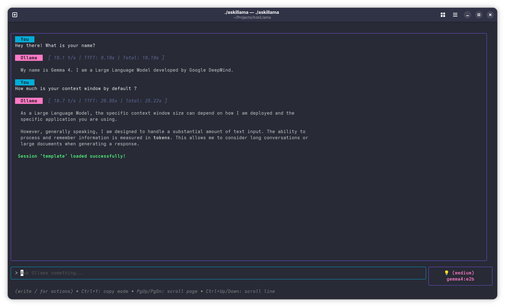
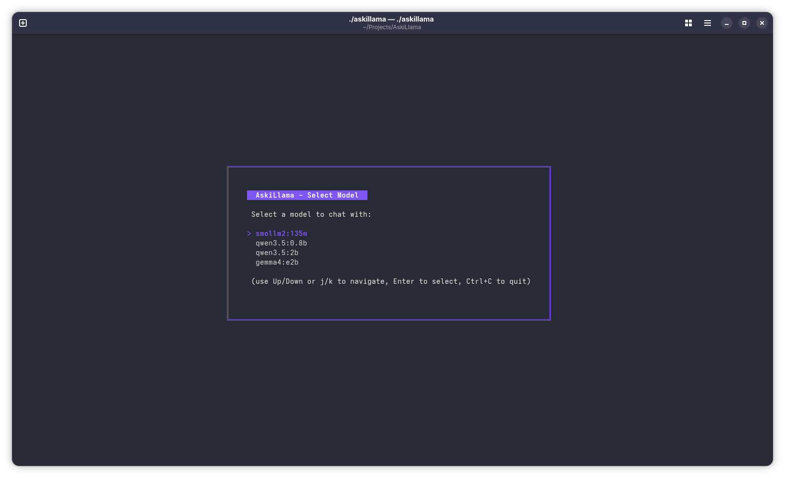
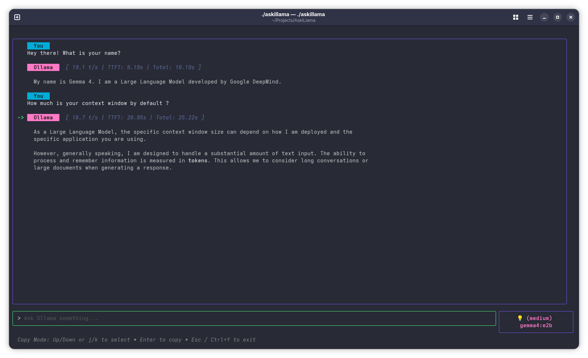

# AskiLlama 🦙

A sleek, fast, and feature-rich Terminal User Interface (TUI) client for [Ollama](https://ollama.com/), built in Go using Bubble Tea and Lip Gloss. Chat with your local LLMs in style, directly from the command line.


---

## Features

- 🖥️ **Interactive Terminal UI**: A gorgeous terminal interface with responsive layouts, border colors, and status indicators.
- 🎨 **Markdown Rendering**: Beautiful, styled markdown rendering in the terminal using Glamour.
- ⚡ **Performance Metrics**: Real-time stats for each response, including:
  - Tokens per second (t/s)
  - Time to first token (TTFT)
  - Total generation time
- 📋 **Interactive Copy Mode**: Select and copy any message to your clipboard without leaving the terminal.
- 💾 **Session Management**: Save and load your conversations to resume them later.
- ⚙️ **Reasoning / Think Control**: Easily control reasoning capability (e.g. for DeepSeek models) with settings from `low` to `max`.
- 📝 **System Prompts**: Dynamically inject custom system instructions into active sessions.
- 📤 **Markdown Export**: Export your chat conversations along with performance metrics to a clean `.md` file.

---

## How to Use

### Prerequisites

1. Install and run **Ollama**. (See [ollama.com](https://ollama.com))
2. Make sure the Ollama server is running (default: `http://localhost:11434`).

### Run AskiLlama

Simply execute the binary to start:

```bash
./askillama
```

If it is your first time running it or if no model is configured, you will be prompted to select from your locally downloaded Ollama models:


---

## Hotkeys

| Key / Shortcut | Action |
| :--- | :--- |
| `Ctrl+C` | Quit the application |
| `Ctrl+Y` | Toggle Copy Mode |
| `PageUp` / `PageDown` | Scroll chat viewport by half a page |
| `Ctrl+Up` / `Ctrl+Down` | Scroll chat viewport line-by-line |

### Copy Mode Navigation

Press `Ctrl+Y` to enter Copy Mode:
1. Use `Up` / `k` and `Down` / `j` to select a message (indicated by `->`).
2. Press `Enter` to copy the text to your system clipboard.
3. Press `Esc` or `Ctrl+Y` to exit copy mode and resume typing.


---

## Slash Commands

Type these directly into the input bar to configure your session on the fly:

| Command | Description |
| :--- | :--- |
| `/model` | Open the model selector to change the active model. |
| `/new` | Clear the current conversation and start a new session. |
| `/system [prompt]` | Set or update the system prompt for the current session. |
| `/think [setting]` | Set reasoning capability: `true`, `false`, `low`, `medium`, `high`, `max`. |
| `/stream [true\|false]` | Toggle or set streaming mode. |
| `/save [session_name]` | Save the current conversation state. |
| `/load [session_name]` | Load a previously saved conversation. |
| `/export [file_name].md` | Export chat history (with metrics) to a markdown file. |

---

## Configuration

AskiLlama automatically creates a configuration file on its first run.

- **Location**: `~/.config/askillama/config.yaml` (or local `config.yaml` if run in the same directory)
- **Default Structure**:

```yaml
host_url: http://localhost:11434
current_model: llama3
stream: true
```

Feel free to change `host_url` if your Ollama instance is hosted on another server or port.
